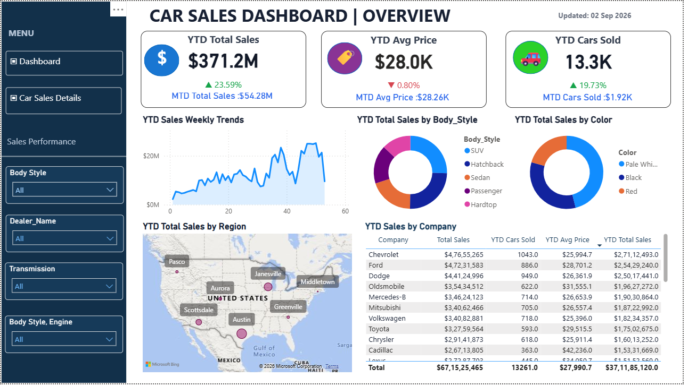
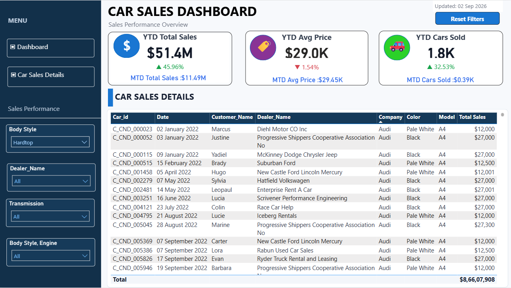

# 🚗 Car Sales Analysis Dashboard | Power BI

An interactive Power BI dashboard developed to analyze car sales performance and generate business-focused insights.

## 📊 Dashboard Overview

The dashboard provides an overview of:

- YTD Total Sales
- YTD Average Price
- YTD Cars Sold
- MTD Sales Performance
- Weekly Sales Trends
- Sales by Body Style
- Sales by Color
- Regional Sales Performance
- Company-wise Sales Analysis

## 🔎 Car Sales Details

The detailed view provides transaction-level information including:

- Car ID
- Date
- Customer Name
- Dealer Name
- Company
- Color
- Model
- Total Sales

## 🛠️ Tools & Technologies

- Microsoft Power BI
- DAX
- Data Analysis
- Data Visualization
- Interactive Filters
- KPI Analysis

## 🎯 Project Objective

The objective of this project is to transform raw car sales data into an interactive dashboard that makes sales performance, trends, and business insights easier to analyze.

## 📸 Dashboard Preview

### Dashboard Overview

### Car Sales Details

## 👨‍💻 Author

**Nikhil More**

Aspiring Data Analyst

**Skills:** Power BI | SQL | Python | Excel | Data Analytics
